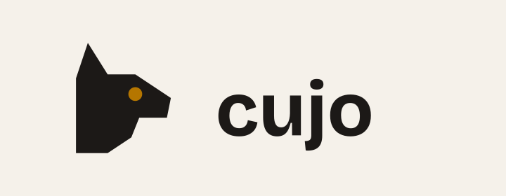

<picture>
  <source media="(prefers-color-scheme: dark)" srcset="brand/readme/banner-dark.svg">
  
</picture>

Cujo reviews pull requests by running them. It clones a PR into a throwaway
sandbox, runs the tests on base and head, probes the changed code, boots the
app, installs any new dependency in isolation, and posts a review that cites
what happened. A review that would block the merge waits for a human to confirm
it.

## Why

A diff shows what changed. It does not show what happens. A reviewer that only
reads the diff cannot see the test that now fails, the endpoint that now
errors, or the install-time payload in a new dependency. Cujo runs the PR
first, somewhere it can do no harm, and tells you what it saw.

## How it works

1. The Cujo GitHub App receives the `pull_request` webhook. `apps/cujo`
   verifies the signature and starts one agent turn with the PR context: repo,
   PR number, base and head SHAs, changed files.
2. The agent provisions a Daytona sandbox, clones both SHAs, seeds a decoy
   secret, and starts a logging proxy. Then it spawns one subagent per check:
   `tests` (the suite on base and head), `probes` (agent-written scripts against
   the changed code), `smoke` (boot the app, hit it), and — when a dependency
   manifest changed — `detonation` (install each added dependency through
   `sniff.py` and record the hosts it contacts, the files it touches, and the
   processes it spawns).
3. Each subagent returns a JSON report. The agent folds them into findings with
   a severity: `info`, `warn`, or `critical`. Hard rules force `critical` on a
   regression, a decoy-secret read, a sensitive write, or unknown egress during
   an install; the agent cannot downgrade those.
4. With no `critical` finding, the review posts automatically as
   `cujo-guard[bot]`: a summary of what ran plus inline comments. With one, the
   review requests changes — and that one action pauses until a human answers
   `/cujo confirm` on the pull request.

No secret ever enters the sandbox. PR code and dependency names go in; JSON
reports come out.

Start with [docs/architecture.md](docs/architecture.md) for the mental model,
then [docs/spec.md](docs/spec.md) for the contracts the code follows. The docs
are canonical: a design change lands there first.

## Built on TrueForge

Cujo runs on [TrueForge](https://trueforge.dev), an open-source agent harness,
used as published — no fork. The harness supplies the model runtime, the Daytona
sandbox, the subagents, the MCP tool that posts the review, and the approval
gate that holds a blocking one. Cujo is the agent, the rubric, the in-sandbox
sensor script, and the service around them: `apps/cujo` is the harness's only
client, and the board in `apps/web` reads that service, never the harness.

## Run it

```bash
cp .env.example .env   # POSTGRES_*, GITHUB_APP_ID, GITHUB_APP_PRIVATE_KEY,
                       # GITHUB_WEBHOOK_SECRET and CUJO_MODEL are required
make up-local          # docker compose up with the local overlay
```

The overlay publishes each service on `127.0.0.1` — the board on 3000, the
TrueForge console on 8790, `cujo` on 8080, `github-mcp` on 8081 — and points
`PUBLIC_BASE_URL` at localhost. (On Linux that loopback isolation needs Docker
Engine `>= 28.0`.) The deploy uses `docker-compose.yml` alone. `make help`
lists the other targets.

Nothing is behind a credential; there is none (decision 57). `cujo` dispatches
on `Host`: `cujo-ingress.localhost:8080/webhook` is the receiver, and the read
API answers on the internal name, where anything outside `/public` is 404.

```bash
curl -s -H 'Host: cujo' http://localhost:8080/public/runs
```

Set `MODEL_PROVIDER_*` and `DAYTONA_API_KEY` to register the model and sandbox
providers at start, or add them in the console. Then point the App's webhook at
`/webhook` — `cloudflared tunnel --url http://localhost:8080` works, with the
`Host` set to the webhook hostname — and open a PR where the App is installed.

Discord notification is optional and bound from inside Discord: the repo names
its server in `.cujo.yml`, someone there with Manage Server runs `/cujo watch`,
and both halves are required. [docs/spec.md](docs/spec.md) Contract 8 and the
`DISCORD_*` entries in `.env.example` have the rest.

## Tests

```bash
corepack enable && pnpm install
pnpm lint && pnpm typecheck && pnpm test   # every external boundary is faked
uv sync && uv run pytest                   # the sensor tests
make test-int                              # apps/cujo against a real harness
```

`make test-int` runs `apps/cujo` against a real harness from the compose file
with a stub model provider, checking what the unit tests assume — turn ids,
replay, chaining, cancel, the approval gate, resume, the fold of real events.
`make test-int-down` stops it.

## Status

The pipeline is in: webhook to session, the four checks, the sensors, the hard
rules (applied by the agent and re-derived in `apps/cujo`), the gated review
answered with `/cujo confirm` on the pull request, conversation with
`@cujo-guard`, Discord notification, and the anonymous read-only board.

## License

MIT. See [LICENSE](LICENSE).
