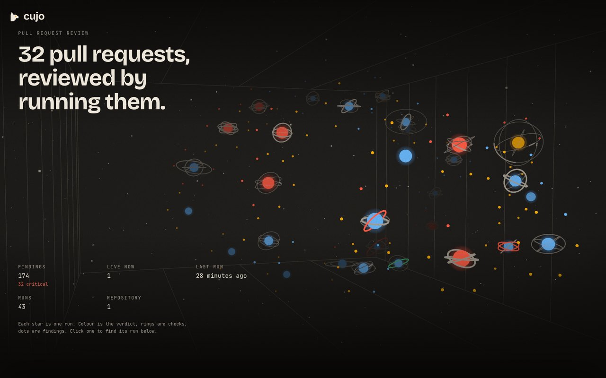
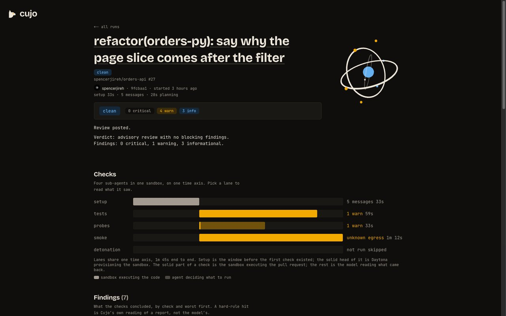

<p align="center">
  <picture>
    <source media="(prefers-color-scheme: dark)" srcset="brand/readme/banner-dark.svg">
    
  </picture>
</p>

<p align="center">
  Cujo reviews pull requests by running them.<br>
  <a href="https://youtu.be/rA7HLMxZypU">Demo video</a> &middot;
  <a href="https://cujo.spencerjireh.com">Live board</a> &middot;
  <a href="docs/architecture.md">Architecture</a>
</p>

It clones a PR into a throwaway sandbox, runs the tests on base and head,
probes the changed code, boots the app, installs any new dependency in
isolation, and posts a review that cites what happened. A review that would
block the merge waits for a human to confirm it.

<p align="center">
  
</p>

## Why

A diff shows what changed. It does not show what happens. A reviewer that only
reads the diff cannot see the test that now fails, the endpoint that now
errors, or the install-time payload in a new dependency. Cujo runs the PR
first, somewhere it can do no harm, and tells you what it saw.

## How it works

1. The Cujo GitHub App receives the `pull_request` webhook. `apps/cujo`
   verifies the signature and starts one agent turn with the PR context: repo,
   PR number, base and head SHAs, changed files.
2. The agent provisions a Daytona sandbox, clones both SHAs, seeds a decoy
   secret, and starts a logging proxy. Then it spawns one subagent per check:
   `tests` (the suite on base and head), `probes` (agent-written scripts against
   the changed code), `smoke` (boot the app, hit it), and — when a dependency
   manifest changed — `detonation` (install each added dependency through
   `sniff.py` and record the hosts it contacts, the files it touches, and the
   processes it spawns).
3. Each subagent returns a JSON report. The agent folds them into findings with
   a severity: `info`, `warn`, or `critical`. Hard rules force `critical` on a
   regression, a decoy-secret read, a sensitive write, or unknown egress during
   an install; the agent cannot downgrade those.
4. With no `critical` finding, the review posts automatically as
   `cujo-guard[bot]`: a summary of what ran plus inline comments. A
   correctness `critical`, a test that passes on base and fails on head,
   requests changes on Cujo's own authority. Any other `critical` is the
   model's judgment, so that review pauses until a human answers
   `/cujo confirm` on the pull request.

<p align="center">
  
</p>

No secret ever enters the sandbox. PR code and dependency names go in; JSON
reports come out.

The board carries a user-facing manual at `/docs` — installing it, `.cujo.yml`,
what each check measures, the gate, Discord, and running your own instance.

Start with [docs/architecture.md](docs/architecture.md) for the mental model,
then [docs/spec.md](docs/spec.md) for the contracts the code follows. The docs
are canonical: a design change lands there first.

## Built on TrueForge

Cujo runs on [TrueForge](https://trueforge.dev), an open-source agent harness,
used as published — no fork. The harness supplies the model runtime, the Daytona
sandbox, the subagents, the MCP tool that posts the review, and the approval
gate that holds a blocking one. Cujo is the agent, the rubric, the in-sandbox
sensor script, and the service around them: `apps/cujo` is the harness's only
client, and the board in `apps/web` reads that service, never the harness.

## Use it on your repository

1. Install the App on a public repository at
   <https://github.com/apps/cujo-guard>. Nothing else needs configuring, and
   the repository stays public because nothing in Cujo holds a clone
   credential.
2. Open a pull request. Within seconds it wears an eye reaction, which proves
   delivery, and a few minutes later one review from `cujo-guard[bot]`.
   Checked on 2026-08-30 with a repository the App had never seen,
   [cujo-install-check#1](https://github.com/spencerjireh/cujo-install-check/pull/1):
   reaction after 5 s, a `REQUEST_CHANGES` review for the broken test after
   1 m 41 s, and the run on the board.
3. Protect the branch if a review should block. A `REQUEST_CHANGES` review
   only gates a merge where the target branch requires review.

Cujo infers the install, test and boot commands from the repository's own build
files. A `.cujo.yml` overrides what it got wrong, and a `cujo:skip` label or a
draft state stops a run before a sandbox is provisioned. The manual on the
board has the rest at <https://cujo.spencerjireh.com/docs/install>.

## Run your own

```bash
cp .env.example .env   # POSTGRES_*, GITHUB_APP_ID, GITHUB_APP_PRIVATE_KEY,
                       # GITHUB_WEBHOOK_SECRET and CUJO_MODEL are required
make up-local          # docker compose up with the local overlay
```

The overlay publishes each service on `127.0.0.1` — the board on 3000, the
TrueForge console on 8790, `cujo` on 8080, `github-mcp` on 8081 — and points
`PUBLIC_BASE_URL` at localhost. (On Linux that loopback isolation needs Docker
Engine `>= 28.0`.) The deploy uses `docker-compose.yml` alone. `make help`
lists the other targets.

Nothing is behind a credential; there is none ([decision 57](docs/decisions.md#57-the-operator-plane-is-deleted-every-route-is-signature-gated-or-anonymous)). `cujo` dispatches
on `Host`: `cujo-ingress.localhost:8080/webhook` is the receiver, and the read
API answers on the internal name, where anything outside `/public` is 404.

```bash
curl -s -H 'Host: cujo' http://localhost:8080/public/runs
```

Set `MODEL_PROVIDER_*` and `DAYTONA_API_KEY` to register the model and sandbox
providers at start, or add them in the console. A self-hosted instance needs
its own GitHub App, so that the private key is yours. Permissions are Contents
read, Metadata read, Pull requests write and Issues read, events are
`pull_request`, `issue_comment`, `pull_request_review_comment` and
`repository`, and the webhook posts to `/webhook` with the secret from
`GITHUB_WEBHOOK_SECRET`. For a laptop, `cloudflared tunnel --url
http://localhost:8080` works, with the `Host` set to the webhook hostname. Then
open a PR where the App is installed. The board's
[self-host page](https://cujo.spencerjireh.com/docs/self-host) has the same in
more detail.

Discord notification is optional and bound from inside Discord: the repo names
its server in `.cujo.yml`, someone there with Manage Server runs `/cujo watch`,
and both halves are required. [docs/spec.md](docs/spec.md) Contract 8 and the
`DISCORD_*` entries in `.env.example` have the rest.

## Tests

```bash
corepack enable && pnpm install
pnpm lint && pnpm typecheck && pnpm test   # every external boundary is faked
uv sync && uv run pytest                   # the sensor tests
make test-int                              # apps/cujo against a real harness
```

`make test-int` runs `apps/cujo` against a real harness from the compose file
with a stub model provider, checking what the unit tests assume — turn ids,
replay, chaining, cancel, the approval gate, resume, the fold of real events.
`make test-int-down` stops it.

## Qodo Code Review Evidence

Qodo reviews every pull request automatically. It reads
[`best_practices.md`](best_practices.md), a mirror of the Standards section in
[`CONTRIBUTING.md`](CONTRIBUTING.md), so the bot checks the same rules a human
reviewer would. Every Qodo comment is applied or answered with a one-line
reason and resolved before merge, and nothing merges with an open thread.

Counted from the GitHub API on 2026-08-30.

- **106** merged pull requests, every one reviewed by Qodo.
- **93** received findings, **380** inline review threads in total, and **13**
  came back clean.
- **23** drew two or more review passes after fixes were pushed.

Two pull requests to read.

[PR #70 — the board opens on the chamber, not a table](https://github.com/spencerjireh/cujo/pull/70)
shows the follow-up loop against final code. Qodo reviewed it five times. The
first pass raised five bugs in the WebGL chamber, among them startup without a
`.catch()`, an activity cap that could overflow, an inert sort control, and
lost initial focus. The fix commit drew a second pass with five more, among
them a floor-grid resource leak and a delayed startup that bypassed the
visibility check. The last pass, at 15:47 UTC, ran against the final commit,
at 15:44 UTC, and closed on one test-coverage note. Fifteen threads, all
resolved before merge.

[PR #49 — answer @cujo-guard in its own session, with no way to write](https://github.com/spencerjireh/cujo/pull/49)
shows what the review is for. The PR adds the conversational feature. When
someone mentions `@cujo-guard` on a pull request, Cujo replies in a read-only
session that can reference the run but never approve or dismiss it. Qodo
raised 14 findings across security (the conversation payload leaked context
that should not cross the trust boundary), correctness (the reply could target
a stale PR head, and a failed turn still posted an answer), and reliability
(the timeout left a consumer active, and a rate-limiter map could grow without
bound). Each got a code fix, a design-decision citation, or a one-line reason,
and the final commit on the branch applies its last finding, the dead-turn
reply.

## License

MIT. See [LICENSE](LICENSE).
