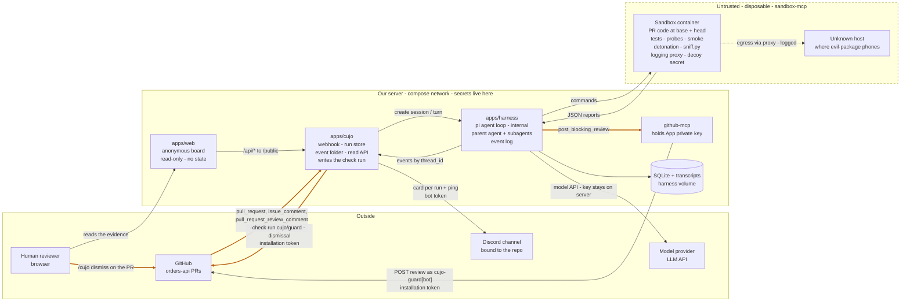

# Architecture

## The idea

A pull request diff shows what changed. It does not show what happens. A
reviewer that only reads the diff cannot see the test that now fails, the
endpoint that now returns 500, or the install-time payload in a new
dependency. It can guess; it cannot know.

Cujo reviews a pull request by running it. It clones the PR into a disposable
sandbox, runs the repo's tests on base and head, writes and runs its own probes
against the changed code, boots the app and hits it, and — when the PR adds a
dependency — installs that dependency in isolation and records what the
install does. The review it posts cites what happened, not what the diff
suggests.

Running a pull request means running a stranger's code. `pip install` alone
runs a package's `setup.py` before any of your own code executes. So all of it
runs where it holds no credentials and has no path back to our server, and the
sandbox is thrown away afterwards.

Not every pull request needs running, and since decision 133 Cujo is a diff
reviewer that can execute rather than a sandbox with a reviewer in it. The
**diff review** reads the pull request on the trusted side — the diff, cut to a
cap, and the repository's own standards files at base — on a cheap model with a
token budget and no sandbox at all, and posts one advisory review whose
findings are at most `warn`, because a block needs evidence only execution can
give. The **sandbox review** is everything the paragraphs above describe. A
repository picks with `mode:` in `.cujo.yml`; a dependency-manifest change or a
Bot-authored pull request is the sandbox regardless (decision 135).

## Components

| Piece | Role |
|-------|------|
| **`apps/harness`** | The agent harness (decision 123): sessions, turns, the event log, an approval gate no spec names since decision 138, and the sub-agent tool, over the pi coding agent SDK for the loop, the provider layer, retry and compaction. Reached only by `apps/cujo` over HTTP. No console, no database service: one SQLite file and the pi transcripts on a volume. The contract between the two is `packages/harness-contract`. |
| **Cujo agent** | The parent reviewer: a language model, the review rubric as its instructions, a sandbox, subagents, and a GitHub tool. It sets up the sandbox, delegates the checks, merges the findings, and posts. |
| **Diff reviewer** | The same model family under a second rubric, `agent/DIFF.md`, on a session of its own with `github-mcp` alone and no sandbox (decisions 133, 137). It reads the package `apps/cujo` prepared — the compressed diff, the standards files, what the last review on the pull request said — and posts one `post_advisory_review`. Bounded by a token budget the harness enforces (decision 132). |
| **Check subagents** | One per check — `tests`, `probes`, `smoke`, `detonation`. Each is a nested pi session (decision 124) that starts with fresh context (the rubric and the sandbox tools, no shared history, no review tool) and returns only a JSON report to the parent; its events are written to the log as they happen, so a parent that times out later loses nothing the child reported. |
| **The sandbox** | A disposable container where the untrusted PR runs, provisioned by `sandbox-mcp` below. One per turn, destroyed after it. |
| **`sandbox/`** | The in-sandbox sensor code: `sniff.py` and the `cujo_sniff` package behind it. Installs one dependency behind the logging proxy and prints a forensic JSON report; its sensors (proxy, filesystem diff, decoy, Python audit hook) are shared by every check, and each report says which of them was watching while it was produced (decision 54). |
| **`apps/cujo`** | The Cujo service and the harness's only client. Receives the webhook, keeps the registry of repositories the App holds (decision 151), starts the turn, folds the turn's event stream into a run, serves the JSON API, writes the `cujo/guard` check run on each commit it reviews, and lifts a block when a maintainer says so (decision 138). It has served no HTML since decision 27. Signature-gated ingress, an anonymous read-only `/public` group (decision 34, decision 57), and, when the App's OAuth client is configured, the owner plane under `/auth` and `/owner` behind a GitHub sign-in (decision 153). |
| **`apps/web`** | The UI, and the only thing a human opens. A Next.js app holding no secrets and no state; every call goes through its own `/api/*` route handlers to `apps/cujo`. One hostname and one plane: the anonymous read-only board (decision 57), plus the manual at `/docs`, which is static, calls nothing, and is the only path on this site that asks to be indexed (decision 98). The manual is reached from two buttons on the footer, *Manual* and *Install the App*, and from a link on the hero legend; the site has no navigation bar. |
| **Cujo GitHub App** | The bot identity. Receives PR events and posts reviews as `cujo-guard[bot]`. |
| **`github-mcp`** | A small MCP server the agent calls to post a review or block a PR. Authenticates as the GitHub App. |
| **`sandbox-mcp`** | The other MCP server, and the sandbox itself (decision 113). Five tools — create, exec, write, read, destroy — over one interface with two implementations, chosen by `CUJO_SANDBOX_RUNTIME`: `local` is a container on our own host with egress enforced by a gateway outside it, `daytona` is the vendor kept so the move is reversible. The harness provisions nothing; the agent reaches a box only through these five tools, which the harness exposes to the model by name (decision 128). |
| **The egress gateway** | One container per sandbox, on that sandbox's network *and* one with outside access. It is the sandbox's router — it claims the gateway address the sandbox's default route points at, on a bridge the host holds no address on — and its resolver, answering for `allow_hosts` plus the clone host and NXDOMAIN for everything else, and it filters what it forwards with nftables from that same list (decisions 116, 121). Default deny. The code under review can reach it and cannot reconfigure it. The in-sandbox proxy is a sensor now, not a control. |
| **Discord notifier** | Part of `apps/cujo`. Watches every run's status and keeps one message per run in the channel bound to that repo, plus one ping when a run blocks. Notifies only; nobody lifts a block from Discord (decision 23). A card links to the board for a public run and nowhere for a private one, which has no page (decision 57). Optional: with no bot token the service runs and says nothing. |
| **`/cujo` command** | The other half, also in `apps/cujo`. A server a repo has named in its `.cujo.yml` picks its own channel and ping role from inside Discord (Contract 8). Slash commands over an HTTP interactions endpoint, not a gateway. It routes notifications and nothing else — a block is lifted on the pull request. |
| **`ocr-sidecar`** | Alibaba's Open Code Review beside every run (decision 149): a trusted service with git and the `ocr` binary that clones the pull request anonymously, runs `ocr` over base and head, and answers `apps/cujo` with the JSON envelope, which is stored per run in `run_ocr_reviews` and posted nowhere. Holds one model key and no GitHub credential. Optional: with no `CUJO_OCR_SIDECAR_URL` no run asks. |
| **Demo repos** | `orders-api`, the app we protect, and `evil-package`, a staged malicious dependency for the demo. |

## The trust boundary

Two zones, with a narrow bridge between them.

- **Trusted (our server):** `apps/harness`, the Cujo agent and its API keys,
  `apps/cujo`, `github-mcp` and `sandbox-mcp`. Secrets live here, the Discord
  bot token among them.
- **Untrusted and disposable (the sandbox):** the PR's code, its
  dependencies, the check subagents' scripts, `sandbox/`, and the logging
  proxy.

Only two things cross the bridge: the PR (its code and its public metadata) and
dependency names go in, and JSON reports come out. (Cujo's own sensor script and the commands the subagents run
go in too; they are ours, carry no secret, and are the instrument, not the
specimen. So does a public run's own id, which is already public and names no
host — decision 36.) No secret ever enters the sandbox. This is the property the
whole design protects, so keep it in mind when reading the flow below.

The diff review moves nothing across this line. The diff and the standards
files reach the model from the trusted side, through the App's own read, and
the model's session has no sandbox tool to reach for; a diff run is a run in
which the bridge is never opened.

## System map

Three zones. The harness is one box in the middle zone: it runs the agent, but
nothing outside the server talks to it. `apps/cujo` is the only thing GitHub
touches, and no person reaches it directly: a human reads the evidence on the
board and lifts a block on the pull request. Thick edges are the block and the
unlock's path.



Every crossing, with what it carries and what protects it:

| From → To | Transport | What crosses | Auth |
|-----------|-----------|--------------|------|
| GitHub → `apps/cujo` | HTTPS webhook on `cujo-ingress.spencerjireh.com` | PR opened or synchronized: repo, PR number, base and head SHA. And the App's own `installation` and `installation_repositories` events: an installation id and the repositories it gained or lost, into the registry (decision 151) | HMAC signature |
| `apps/cujo` → `apps/harness` | HTTP on the compose network (`packages/harness-contract`) | `POST /sessions` with the inline agent spec; `POST /turns` with the PR context, then the turn's SSE subscription; `GET /events` on restart, uncapped | None needed; the harness has no public route |
| `apps/harness` → `apps/cujo` | The same stream, reverse direction | Events tagged by `threadId`: `thread.created`, `model.message` with its text, `tool.response`, `thread.done` (the JSON report) | Same connection |
| Agent → `sandbox-mcp` → sandbox | MCP on the compose network, then `docker exec` into the box | The PR's code: a public, tokenless `git clone` of the repo checked out at base and head. The PR's public metadata (number, SHAs, changed files, title, description). The dependency names from the manifest diff. Cujo's own `sandbox/` sensor code and the commands the subagents run. The run's own id, when the repo is public, so the review can name its evidence page — an id and never a URL, so no hostname crosses (decision 36). For a pinned specifier this pull request adds that this instance detonated within seven days, that earlier run's detonation entry — sandbox-produced data that already crossed the other way, carrying no secret and, for a private source run, no run id (decision 145). | Internal, and nothing in the box. The image, the container runtime and the host paths come from `sandbox-mcp`'s own environment and are never tool inputs, so a caller cannot choose what it runs in. Private repos are a non-goal, so no clone credential exists to leak |
| Sandbox → the harness | Command stdout, through `sandbox_exec` | One JSON report per check with the sensor block, the sensor-health block, and every string in it escaped. A stream over 32 KB comes back as its head and tail around a marker naming the file in the box that holds all of it (decision 142) | None; treated as untrusted data, which is what the escaping is for |
| Sandbox → anyone, through the harness | — | **Nothing.** The harness owns no sandbox and serves no download (decision 113). A check report reaching the parent as text on a thread event is the only way anything leaves, and `sandbox_read_file` is the only read into the box, bounded by `max_bytes` | Closed by there being nothing to close |
| Sandbox → internet | Through the egress gateway, outside the box (decision 116) | Only what `allow_hosts` named, resolved by name. Everything else is dropped on a network the sandbox has no route off. The in-sandbox proxy still records every attempt, so `egress[]` is still the evidence — and a row in it now means a connection that genuinely did not leave | Default deny at the network layer, in a container the code under review cannot reach. The decoy secret is still the only "secret" it can find |
| A repository's `.cujo.yml` → the gateway | `allow_hosts` on `sandbox_create` | Hostnames, and nothing else. This is untrusted text configuring a **trusted-side** control, which it was not before, so it is validated and refused rather than repaired: no scheme, port, path, CIDR, wildcard, credentials, control character or address, and at most 32 entries (decision 116) | Validated in `apps/sandbox-mcp/src/allowlist.ts` before any runtime sees it |
| `apps/harness` → model provider | HTTPS, OpenAI-compatible chat completions | Prompts, reports, tool calls | Provider key, registered once on the harness by `apps/cujo` at boot and held in memory there |
| `apps/harness` → `github-mcp` | MCP on the compose network | `post_advisory_review` or `post_blocking_review`, one call, neither held (decision 138) | Internal |
| `github-mcp` → GitHub | REST API | The review, as `cujo-guard[bot]`: a body **composed by `github-mcp`** from the agent's findings, coverage and egress (verdict headline, findings by severity, coverage, egress, a machine-readable block — decision 74), plus one inline comment per anchored finding, derived from the findings rather than sent beside them; `apps/cujo` rebuilds both with the same `@cujo/review-render` package for the board | Installation token minted from the App private key |
| `apps/cujo` → GitHub | REST API | One reaction on the pull request description, tracking the run's status (Contract 9). No text, no finding, no decision — the closed set of eight emoji is the whole payload | Installation token minted from the App private key; `pull_requests: write`, which the App already holds (decision 38) |
| `apps/cujo` → GitHub | REST API | A reply on the pull request, and a reaction on the comment it answers (decision 43). Text, but only ever in answer to a person who addressed Cujo directly — never an unprompted finding | Installation token minted from the App private key; the same `pull_requests: write` |
| `apps/cujo` → `apps/harness` | HTTP on the compose network | A **second** session per pull request, for conversation only (Contract 10): a spec carrying `sandbox-mcp` and no review tool, then one turn per question. Never the review's session, which a second turn would cancel or corrupt | Internal |
| Human → `apps/web` | HTTPS on `cujo.spencerjireh.com` | Reads runs, check cards, findings and the posted review for a **public** repo, redacted by the allowlist in `http/public/serialize.ts`. An owner, signed in with GitHub on the App's own OAuth client (decision 153), also carries a session cookie the proxy turns into a bearer for `/owner/*`: settings and the repository switch, nothing on the anonymous board. The board opens on a full-height chamber that stays pinned while the rest of the board rises over it, holding the thirty newest runs as a galaxy three layers deep — each run a star system: a core sized by the worst thing it found, one ring per check on a tilt seeded off the run's id, as wide as the check watched and bright for the share of that spent executing, and up to six satellites for what it found (decisions 65, 68, 82) — then a rack of summary strips, then the record, then the key to the drawing. A run's **layer** is time, newest in front, and its position within the layer — across it and a little into it — is a deterministic function of its id that means nothing, which the key says in words; everything else in there is a measurement, down to the light that walks the stars, which is the board re-reading this API, oldest run first, and beats each star once as it reads it (decisions 83, 95). A running run is green, the one tone that is not a verdict (decision 94). The decorative layer admitted alongside it is the air in the room and the star field behind it, and lives in exactly two files (decisions 80, 82). Clicking a star scrolls the record to its row rather than leaving the board, and a run's own page draws the same object turning beside the pull request's title. Nothing flat is served in the chamber's place: a phone, and a browser that will not give it a WebGL context, get the readout and then the record. There is no site header: the mark and the name sit in the corner of whichever page is rendering it. Hovering a star, or a record row, swaps the hero's readings for the key to the drawing (decision 89); a record row is one link, its checks and findings one cell (decision 88), and the newest run of a pull request pushed to twice is marked latest with the older dimmed (decision 92). A run page opens on a verdict card and the timeline, then the evidence log (decision 154): what happened in order, each check's commands, sensor facts and findings on the page, with the tables, the notes and the composed review folded (decision 93 for bulk, not facts), and the operator's numbers last (decision 91). It writes nothing and decides nothing: a block is lifted with `/cujo dismiss` on the pull request (decisions 49, 138), and a Discord channel is bound with `/cujo watch` (decision 57) | None. There is no credential and no authenticated route left |
| `apps/cujo` → GitHub | REST API | The `cujo/guard` check run on the reviewed commit, moved with the run's status: in progress at the claim, success, failure on a block, neutral once dismissed (decision 138). And, on `/cujo dismiss`, the dismissal of the bot's own REQUEST_CHANGES review. A status and a login, never a finding | Installation token minted from the App private key; `checks: write` and `pull_requests: write` |
| `apps/cujo` → `ocr-sidecar` | HTTP on the compose network | The repository, the pull request number, its public clone URL, the base and head SHAs, the title and the body — what the sandbox already receives, and nothing more. Fire-and-forget: the review never waits (decision 149) | None; internal, and the sidecar refuses any clone URL that is not the named repository on GitHub |
| `ocr-sidecar` → GitHub | A public, tokenless `git clone`, then `refs/pull/<n>/head` | Nothing outbound but the fetch; the head must resolve to the SHA the caller named or the review is refused | None; private repositories are a non-goal, so no credential exists to leak |
| `ocr-sidecar` → model provider | HTTPS, OpenAI- or Anthropic-compatible | The diff, the files `ocr` reads from the checkout, the title and body as background. The repository's own `.opencodereview/` is deleted from the checkout first, so a pull request cannot steer the rules | `OCR_LLM_TOKEN`, held only by the sidecar |
| `ocr-sidecar` → `apps/cujo` | The same request's answer | `ocr`'s JSON envelope, stored verbatim in `run_ocr_reviews`; it never reaches `/public`, the board, the fold or a pull request | Same connection |
| `apps/web` → `apps/cujo` | HTTP on the compose network | `/auth/*` for sign-in: a start, then the code and state GitHub sent back; `/owner/*` with the session as a bearer. The cookie itself never crosses; the OAuth client secret lives in `apps/cujo` only (decision 153) | The session, made by this process at sign-in and stored hashed |
| `apps/cujo` → GitHub | HTTPS to `github.com` and `api.github.com` | The OAuth code exchange with the App's client id and secret, then three reads on the person's token — who they are, which installations they see, their role in an organisation — to decide whether they are an owner. The token is not kept | The App's OAuth client secret; the person's short-lived token, used at sign-in and dropped |
| Discord → `apps/cujo` | HTTPS to `cujo-ingress.spencerjireh.com` | A `/cujo` interaction: the server, the invoking member and their permissions, and the chosen repo, channel and role (Contract 8) | Ed25519 over `timestamp + rawBody`, verified against `DISCORD_PUBLIC_KEY`; an invalid signature is 401 |
| `apps/cujo` → Discord | HTTPS to `discord.com/api/v10` | One card per run, edited in place: repo, PR number, status, check names, finding titles and evidence, and the run's Cujo link. Every derived string escaped, stripped of bidi, truncated, and mention-suppressed (Contract 7) | `Authorization: Bot`; `DISCORD_BOT_TOKEN`, held only by `apps/cujo` and never near the sandbox |

## The block and the unlock

The mechanism the design hinges on since decision 138: nothing is held. A
`critical` finding posts a REQUEST_CHANGES review at once, `apps/cujo` fails
the `cujo/guard` check run on the commit, and the merge is held by branch
protection until the App completes that check — which it does only when a
person with write access, who is neither the author nor a bot, says so on the
pull request.

```mermaid
sequenceDiagram
  autonumber
  participant GH as GitHub
  participant C as apps/cujo
  participant TF as apps/harness
  participant Sub as Check subagents
  participant H as Human
  participant M as github-mcp

  GH->>C: pull_request webhook (HMAC)
  C->>GH: check run cujo/guard: in_progress
  C->>TF: POST /sessions, POST /turns (PR context), subscribe
  TF->>Sub: create_sub_agent x tests, probes, smoke, detonation
  Sub-->>TF: JSON report
  Note over TF: a hard rule forces critical
  TF->>M: post_blocking_review(the findings)
  M->>GH: REQUEST_CHANGES review as cujo-guard[bot]
  TF-->>C: turn.done
  C->>C: run status = blocked
  C->>GH: check run cujo/guard: failure
  H->>GH: /cujo dismiss on the pull request
  GH->>C: issue_comment webhook (HMAC)
  C->>GH: who is this person? (write, not the author, not a bot)
  C->>GH: dismiss the bot's review; check run: neutral, "Dismissed by @login"
  C->>C: run status = dismissed, approver = github:login
```

A block is terminal: the review is on the pull request and nothing is
followed. Only a dismissal moves it, and the dismissal is claimed in the store
before GitHub is written, so two comments racing for one block dismiss the
review once (Contract 1). A new commit gets its own run, its own review and its
own check, so a block is never carried forward and never dismissed forward.

The harness keeps its approval mechanism — a gated tool name suspends a turn
with the call held in pi's `beforeToolCall` hook, and the answer is the next
turn's input (decision 125) — but no spec gates a tool any more. A session
pinned to an older spec that still asks is folded as an `error` naming the
call, not waited on.

With no `critical` finding the agent calls `post_advisory_review`; with one it
calls `post_blocking_review`. One call, never two. If a new head is pushed
while a run is still going, that run ends `superseded` and the new head gets
its own run on the same session; only the newest head is reviewed.

## End-to-end flow

1. **A PR arrives.** Someone opens or updates a pull request on the protected
   repo. The Cujo GitHub App fires a `pull_request` webhook.
2. **Cujo picks the review and wakes the agent.** `apps/cujo` verifies the
   webhook, reads the PR metadata and changed-file list, and resolves the mode
   (Contract 1): `CUJO_REVIEW_MODE`, then `mode:` from `.cujo.yml` at base,
   then the two floors. A **diff** run gets a fresh session on the diff spec
   and a package prepared in code (Contract 11) — the diff cut to a byte cap,
   the standards files at base, the previous review's findings — and its turn
   is one reading and one `post_advisory_review`; steps 3 to 5 never happen.
   A **sandbox** run starts one turn in the PR's Cujo session with the PR
   context: repo, PR number, base SHA, head SHA, changed files. Either way it
   stays subscribed to the turn's event stream and folds what it sees into a
   run the UI can show while the review is still going.
3. **Into the sandbox.** The agent provisions a sandbox through `sandbox-mcp`
   and runs two commands. `sniff.py prepare` clones head, adds a worktree at base, and hands
   back `.cujo.yml` from base if the repo has one (policy comes from the target
   branch, never from the PR) together with the head's build files, so the
   parent settles policy and infers the commands in one step rather than five
   (decision 71). `sniff.py setup` then seeds the decoy secret and starts the
   logging proxy and the decoy watcher.
4. **Run the checks.** Nothing a check needs comes from another and the sensors
   serialise themselves (decision 41), so each is spawned as early as it can do
   anything: `detonation` during setup, since it installs into its own fresh
   environment and needs nothing the repository's install produces, then the
   other three together once that install is done (decision 73). `tests` runs
   the suite on base and head. `probes` writes and runs scripts against the
   changed functions. `smoke` boots the app and hits it. `detonation` runs
   only when a dependency manifest changed, installing each new or bumped
   dependency through `sniff.py`. Each subagent returns a JSON report with a
   shared sensor block: egress, file reads, writes, subprocesses, plus which
   sensors were watching and where a cap cut the evidence short. The shape is
   `docs/contracts/report.example.json`.
5. **Decide.** The parent turns the reports into findings. Hard rules force
   `critical` on a regression, a decoy read, a sensitive write, or unknown
   egress during an install, and `warn` when a sensor was not watching. The agent assigns `info`, `warn`, or `critical`
   to everything else against the rubric, then hands `github-mcp` its findings,
   its coverage and the egress it saw. The server composes the review — verdict
   first, provenance after — and anchors what can be anchored (decision 74).
6. **Post.** With no `critical` finding the review posts as a comment from
   `cujo-guard[bot]`. Any `critical` posts as REQUEST_CHANGES, with no human
   asked, and `apps/cujo` fails the `cujo/guard` check on the commit; a
   maintainer lifts the block with `/cujo dismiss` on the pull request
   (decision 138). The exact rule is in [spec.md](spec.md).

## User flows

The six shapes a pull request actually takes, end to end.

**A. Nothing is wrong (the common case).** PR opens, Cujo reacts on it within a
second of the delivery, the sandbox runs the four checks, one COMMENT review
lands with inline comments, and the reaction settles on the `clean` state
(Contract 9). No human. **This flow has to stay boring** — it is the argument
that Cujo is automation and not a form to fill in.

**B. The pull request breaks something.** `tests.base_pass_head_fail` comes back
non-empty, so a hard rule forces `critical`, the agent calls
`post_blocking_review`, and REQUEST_CHANGES posts unattended. The author pushes
a fix, the new run supersedes the old one, and the advisory posts. Still no
human. The `cujo/guard` check failed on the broken commit and succeeds on the
fixed one, and branch protection that requires it is what held the merge in
between.

**C. "Prove it."** An inline comment says a smoke endpoint returned 500 on head
and 200 on base. The maintainer replies in that thread asking for a seeded
database. That is a `pull_request_review_comment` and not an `issue_comment`,
which is why conversation subscribes to both. Cujo answers in the same thread
from a separate session that holds no write tool (Contract 10, decision 47).

**D. The unlock.** Detonation sees egress to an unknown host during an
install. The hard rule forces `critical`, REQUEST_CHANGES posts with the host,
the port and the time as the evidence, and the check fails; the merge is held.
A maintainer who knows the host writes `/cujo dismiss` on the pull request:
Cujo checks they have write access, are not the author and are not a bot
account (decision 44, 138), dismisses its own review naming them, turns the
check neutral, and the run ends `dismissed`. The findings stay on the pull
request. Or nobody answers: the block stands until a new commit gets its own
run, and there is no deadline — a held merge is the safe direction.

**E. Teaching.** Three pull requests in a row flag the same host, a maintainer
says `@cujo-guard that host is ours`, and Cujo opens a `.cujo.yml` pull request
adding it to `allow_hosts`; merging it is the authorization. **Not built** —
designed and tracked in [issue #56](https://github.com/spencerjireh/cujo/issues/56).

**F. Outside contributor.** A fork pull request from someone with no write
access. They read every finding and may reply to humans, and Cujo refuses both
their `/cujo` commands and their `@cujo-guard` messages, out loud. This is the
security boundary made visible: reading is public, deciding is not.

## Deployment topology

Everything runs on one Hetzner server (`hetzner-server-1`, Helsinki), deployed by
Coolify in a single `docker-compose` project so the services share a network.

- **`harness`** — `apps/harness` on port 8790, reached by `apps/cujo` at
  `http://harness:8790` on the compose network and by nothing else. Not
  published: there is no console to publish (decision 123), and the model key
  it holds arrives from `cujo` at boot and lives in memory. A volume holds its
  SQLite event log and the pi transcripts. Hardened like `cujo`: non-root,
  read-only rootfs except the volume, no capabilities. It waits on both MCP
  servers being healthy, because a turn bridges their tool lists before it
  starts.
- **`cujo`** — the `apps/cujo` service, API-only since decision 27, on one
  published hostname. `https://cujo-ingress.spencerjireh.com` carries the two
  signature-gated ingress routes, with no Access policy, since neither GitHub
  nor Discord can solve an OTP challenge: `/webhook`, protected by the HMAC
  signature, and `/discord/interactions`, protected by Ed25519 (Contract 8).
  That URL is what the Discord application's Interactions Endpoint is set to.
  Its JSON API is not published; `web` reaches it at `http://cujo:8080` on the
  compose network. A volume holds its SQLite run store. It needs outbound HTTPS
  to `api.github.com` and, when Discord is configured, to `discord.com`; with
  no `DISCORD_BOT_TOKEN` set it boots normally and notifies nobody.
  `GET /healthz` is its container healthcheck and reads nothing; `GET /readyz`
  reports whether the harness has bootstrapped, which is the flag the webhook
  gates on. Both answer on each hostname this process serves — the ingress
  host and the internal name — and neither is gated (decision 37).
- **`web`** — the `apps/web` UI, on one hostname.
  `https://cujo.spencerjireh.com` is the anonymous read-only board, which lists
  public repos only and names no approver. `/docs` under it is the user-facing
  manual: statically rendered, dependent on nothing this deploy runs, and the
  one path `robots.txt` allows (decision 98). Two footer buttons, *Manual* and
  *Install the App*, and a link on the hero legend lead to it. `/repos` and
  `/repos/<owner>/<name>` are the owner's pages (decision 156): rendered
  against the session cookie, never indexed, and an invitation to sign in for
  anyone else; a third footer button signs in or out. The operator plane
  of old was deleted with its hostname (decision 57), and
  a block is lifted with `/cujo dismiss` on the pull request (decisions 49,
  138). It proxies the JSON API at `/api/cujo/*` — forwarding only
  `/public/*`, and `GET` only, since the board has no write route — and the run
  stream at `/api/public/runs/:id/events` to `cujo` server-side, so the UI and
  the API stay same-origin (decision 27). `/api/health` is this container's
  healthcheck and never calls `cujo`.
- **`github-mcp`** — internal only, reachable by `harness` over the compose
  network. Holds the GitHub App private key.
- **`sandbox-mcp`** — internal only, reachable by `harness` over the compose
  network, and the one service that holds the host's Docker socket (decision
  114). At boot it builds the two images a review runs — the sandbox from
  `sandbox/Dockerfile` and the egress gateway from
  `apps/sandbox-mcp/gateway/Dockerfile`, both carried inside its own image —
  and answers 503 on `/healthz` and `/mcp` until both exist (decision 118).
  Nothing else builds them: they are `docker run` per sandbox, never compose
  services, so `up --build` does not see them. A cold build is minutes and a
  warm one is seconds, which is what the healthcheck's start period is sized
  for; `cujo` waits on this service being healthy, so the first webhook after a
  deploy never reaches a sandbox that does not exist yet. Needs Docker 28 or
  later on the host: attaching the gateway's outside leg uses
  `network connect --gw-priority` (decision 121).

- **`ocr-sidecar`** — internal only, reachable by `cujo` over the compose
  network at `http://ocr-sidecar:8083`. Holds the `OCR_LLM_*` model key and
  nothing else; clones into a tmpfs; read-only rootfs, non-root, no
  capabilities. `cujo` does not wait on it: with the URL unset no run asks,
  and with the service down every ask is an error row and a warning line
  (decision 149). With no model configured it boots anyway, stays healthy and
  answers 503 to every review: a compose service that exits at start reads to
  Coolify as the whole application having exited, and did, once.

The DNS records exist. Coolify routes `cujo-ingress.spencerjireh.com` to
`cujo` and `cujo.spencerjireh.com` to `web`; a hostname is attachable only once
Coolify has parsed the service from the compose file on `main`, which `web`
already satisfies. `cujo-harness.spencerjireh.com` routed to TrueForge's
console and has nothing behind it since decision 123.
Configuration reaches the services as environment variables set in Coolify;
`.env.example` lists every name. For `cujo`, the models and the provider are
an exception since decision 152: the environment seeds them into the `settings`
table on the first boot that knows each key, and from then on the table is the
source — a change there takes effect on the next session, with no deploy.

Every service logs structured JSON to stdout through `@cujo/log`, one event per
line, which is where Coolify reads it. There is no log collector and no tracing
backend: the per-run detail is already durable in the projection the UI renders,
so what stdout has to answer is service-level (decision 37). `CUJO_LOG_LEVEL`
selects the level and defaults to `info` when unset, so no Coolify variable has
to change for a deploy to be correct.

Merging to `main` is the deploy. Coolify watches the repository over a GitHub
webhook and rebuilds on every push to `main`, so there is no separate release
step. A variable edited in Coolify applies at the next deploy, not when it is
saved, and the running container keeps serving until the new one replaces it. So
between the merge and the swap the live service runs the pre-merge configuration
against post-merge `main`, and anything that spans the two — a `main`-relative
URL held in a variable, most of all — has to stay valid on both sides of it
(decision 35).

The Coolify control plane runs on a separate host (netcup) that never executes
untrusted code.

Cloudflare proxies both hostnames, and a Hetzner Cloud firewall accepts
ports 80 and 443 only from Cloudflare's published ranges, so the origin's own
address is not a way past a gate; port 22 stays open for the control plane.
No Access application fronts anything a person uses any more: `cujo` is
anonymous and `cujo-ingress` takes signatures (decision 57), and the operator
console Access used to gate went with TrueForge (decision 123). The
application scoped to `/.well-known/acme-challenge` (decision 33) is moot for
the same reason and can go with the `cujo-harness` one. A Cloudflare rate-limiting rule bounds requests per address to
the public board's stream route; the process caps concurrent public streams as
well, and the two answer 429 and 503 respectively so a log says which bound bit
(decision 34).
