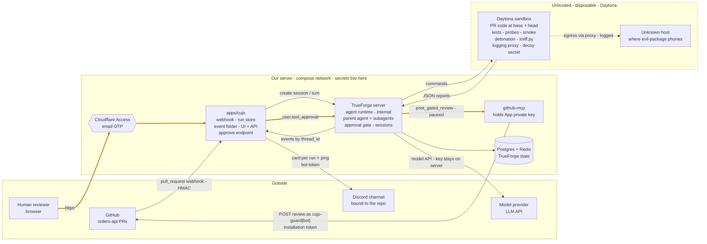
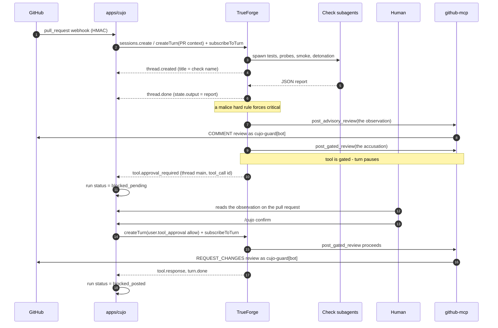

# Architecture

## The idea

A pull request diff shows what changed. It does not show what happens. A
reviewer that only reads the diff cannot see the test that now fails, the
endpoint that now returns 500, or the install-time payload in a new
dependency. It can guess; it cannot know.

Cujo reviews a pull request by running it. It clones the PR into a disposable
sandbox, runs the repo's tests on base and head, writes and runs its own probes
against the changed code, boots the app and hits it, and — when the PR adds a
dependency — installs that dependency in isolation and records what the
install does. The review it posts cites what happened, not what the diff
suggests.

Running a pull request means running a stranger's code. `pip install` alone
runs a package's `setup.py` before any of your own code executes. So all of it
runs where it holds no credentials and has no path back to our server, and the
sandbox is thrown away afterwards.

## Components

| Piece | Role |
|-------|------|
| **TrueForge** | The agent harness — the runtime that turns a model into a working agent. Deployed and live. The centerpiece the hackathon scores. Reached only by `apps/cujo` over the SDK and by `github-mcp` as a tool; its bundled UI is an operator console, not the product. |
| **Cujo agent** | The parent reviewer: a language model, the review rubric as its instructions, a sandbox, subagents, and a GitHub tool. It sets up the sandbox, delegates the checks, merges the findings, and posts. |
| **Check subagents** | One per check — `tests`, `probes`, `smoke`, `detonation`. Each starts with fresh context (its instructions and the sandbox tools, no shared history) and returns only a JSON report to the parent. |
| **Daytona sandbox** | A disposable cloud box where the untrusted PR runs. One per turn, destroyed after it. |
| **`sandbox/sniff.py`** | The in-sandbox sensor script. Installs one dependency behind the logging proxy and prints a forensic JSON report; its sensors (proxy, filesystem diff, decoy, Python audit hook) are shared by every check. |
| **`apps/cujo`** | The Cujo service and TrueForge's only client. Receives the webhook, starts the turn, folds the turn's event stream into a run, serves the JSON API, and resumes a paused turn when a human approves. It has served no HTML since decision 27. Two planes: the Access-gated operator API, and an anonymous read-only `/public` group (decision 34). |
| **`apps/web`** | The UI, and the only thing a human opens. A Next.js app holding no secrets and no state; every call goes through its own `/api/*` route handlers to `apps/cujo`. It answers two hostnames from one container — the public read-only board and the Access-gated operator view — and tells them apart by the request's `Host`. |
| **Cujo GitHub App** | The bot identity. Receives PR events and posts reviews as `cujo-guard[bot]`. |
| **`github-mcp`** | A small MCP server the agent calls to post a review or block a PR. Authenticates as the GitHub App. |
| **Discord notifier** | Part of `apps/cujo`. Watches every run's status and keeps one message per run in the channel bound to that repo, plus one ping when a run blocks on a human. Notifies only; nobody approves from Discord (decision 23). A card links to the public board for a public run and to the operator UI otherwise (decision 34). Optional: with no bot token the service runs and says nothing. |
| **`/cujo` command** | The other half, also in `apps/cujo`. A server a Cujo operator has authorized for a repo picks its own channel and ping role from inside Discord (Contract 8). Slash commands over an HTTP interactions endpoint, not a gateway. It routes notifications and nothing else — approval stays in the Cujo UI. |
| **Demo repos** | `orders-api`, the app we protect, and `evil-package`, a staged malicious dependency for the demo. |

## The trust boundary

Two zones, with a narrow bridge between them.

- **Trusted (our server):** the TrueForge harness, the Cujo agent and its API
  keys, `apps/cujo`, and `github-mcp`. Secrets live here, the Discord bot token
  among them.
- **Untrusted and disposable (the Daytona sandbox):** the PR's code, its
  dependencies, the check subagents' scripts, `sniff.py`, and the logging
  proxy.

Only two things cross the bridge: the PR (its code and its public metadata) and
dependency names go in, and JSON reports come out. (Cujo's own sensor script and the commands the subagents run
go in too; they are ours, carry no secret, and are the instrument, not the
specimen. So does a public run's own id, which is already public and names no
host — decision 36.) No secret ever enters the sandbox. This is the property the
whole design protects, so keep it in mind when reading the flow below.

## System map

Three zones. TrueForge is one box in the middle zone: it runs the agent, but
nothing outside the server talks to it. `apps/cujo` is the only thing GitHub or
a person touches. Thick edges are the one path a human is on.

Every crossing, with what it carries and what protects it:

| From → To | Transport | What crosses | Auth |
|-----------|-----------|--------------|------|
| GitHub → `apps/cujo` | HTTPS webhook on `cujo-ingress.spencerjireh.com` | PR opened or synchronized: repo, PR number, base and head SHA | HMAC signature |
| `apps/cujo` → TrueForge | HTTP on the compose network | `sessions.create` with the inline agent spec; `createTurn` with the PR context, then `subscribeToTurn`; `listEvents` on restart | None needed; TrueForge has no public API route |
| TrueForge → `apps/cujo` | The same stream, reverse direction | Events tagged by `thread_id`: `thread.created`, `tool.response`, `thread.done` (the JSON report), `tool.approval_required` | Same connection |
| TrueForge → sandbox | Daytona API, then commands inside the box | The PR's code: a public, tokenless `git clone` of the repo checked out at base and head. The PR's public metadata (number, SHAs, changed files, title, description). The dependency names from the manifest diff. Cujo's own `sniff.py` and the commands the subagents run. The run's own id, when the repo is public, so the review can name its evidence page — an id and never a URL, so no hostname crosses (decision 36). | Daytona key on the server; nothing in the box. Private repos are a non-goal, so no clone credential exists to leak |
| Sandbox → TrueForge | Command stdout | One JSON report per check with the sensor block | None; treated as untrusted data |
| Sandbox → internet | Through the in-sandbox proxy | Whatever the PR or a dependency tries to reach; logged, becomes evidence | None; the decoy secret is the only "secret" it can find |
| TrueForge → model provider | HTTPS | Prompts, reports, tool calls | Provider key, registered once on the server |
| TrueForge → `github-mcp` | MCP on the compose network | `post_advisory_review` and `post_blocking_review` (free) or `post_gated_review` (paused until a human confirms) | Internal |
| `github-mcp` → GitHub | REST API | The review: summary body plus inline comments, as `cujo-guard[bot]` | Installation token minted from the App private key |
| `apps/cujo` → GitHub | REST API | One reaction on the pull request description, tracking the run's status (Contract 9). No text, no finding, no decision — the closed set of eight emoji is the whole payload | Installation token minted from the App private key; `pull_requests: write`, which the App already holds (decision 38) |
| Human → `apps/cujo` | HTTPS through Cloudflare Access on `cujo.spencerjireh.com` | Reads runs, check cards, findings, the drafted review. Writes one thing: approve or reject | Email OTP; the approve route checks the Access JWT and records the approver |
| `apps/cujo` → TrueForge | HTTP on the compose network | `createTurn` with `user.tool_approval {allow \| deny}`, then `subscribeToTurn`; the turn resumes | Internal |
| Discord → `apps/cujo` | HTTPS to `cujo-ingress.spencerjireh.com` | A `/cujo` interaction: the server, the invoking member and their permissions, and the chosen repo, channel and role (Contract 8) | Ed25519 over `timestamp + rawBody`, verified against `DISCORD_PUBLIC_KEY`; an invalid signature is 401 |
| `apps/cujo` → Discord | HTTPS to `discord.com/api/v10` | One card per run, edited in place: repo, PR number, status, check names, finding titles and evidence, and the run's Cujo link. Every derived string escaped, stripped of bidi, truncated, and mention-suppressed (Contract 7) | `Authorization: Bot`; `DISCORD_BOT_TOKEN`, held only by `apps/cujo` and never near the sandbox |

## The approval path

The mechanism the design hinges on: the pause happens inside TrueForge, the
button lives in Cujo, and the resume goes over the SDK.

On Reject, the resume sends `deny`; the agent posts nothing further and the run
ends `denied` — the advisory observation posted before the pause and stands, so
a denial leaves the evidence on the pull request and drops only the claim about
a person.

**A held approval has no deadline.** The thirty-minute watchdog bounds a turn
that is still streaming and is cleared the moment `turn.done` arrives, which is
exactly what the pause produces, so nothing expires an unanswered accusation. It
waits on `blocked_pending` until a new head supersedes it or a `/cujo` command
decides it, and it stays in the set that rehydrates on restart. The direction is
the safe one — the merge is not blocked and the observation is already
public — but it is a wait, not an expiry, and no code says otherwise.

With no `critical` finding the
agent calls `post_advisory_review` alone; with a `critical` that says the pull
request is broken rather than malicious it calls `post_blocking_review` alone,
which is not gated and ends the run `blocked_unattended`. Neither pauses
(decision 42). If a new head
is pushed while a run is still going, that run ends `superseded` and the new
head gets its own run on the same session; only the newest head is reviewed.
Superseding a run that was waiting on a human also answers its approval, since
the session refuses the new head's turn while one is pending (decision 39).

## End-to-end flow

1. **A PR arrives.** Someone opens or updates a pull request on the protected
   repo. The Cujo GitHub App fires a `pull_request` webhook.
2. **Cujo wakes the agent.** `apps/cujo` verifies the webhook, reads the PR
   metadata and changed-file list, and starts one turn in the PR's Cujo
   session with that context: repo, PR number, base SHA, head SHA, changed
   files. It stays subscribed to the turn's event stream and folds what it
   sees into a run the UI can show while the checks are still going.
3. **Into the sandbox.** The agent provisions a Daytona sandbox, clones head,
   adds a worktree at base, seeds the decoy secret, starts the logging proxy
   and the decoy watcher, and reads `.cujo.yml` from base if the repo has one
   (policy comes from the target branch, never from the PR).
4. **Run the checks.** The agent spawns one subagent per check. `tests` runs
   the suite on base and head. `probes` writes and runs scripts against the
   changed functions. `smoke` boots the app and hits it. `detonation` runs
   only when a dependency manifest changed, installing each new or bumped
   dependency through `sniff.py`. Each subagent returns a JSON report with a
   shared sensor block: egress, file reads, writes, subprocesses.
5. **Decide.** The parent turns the reports into findings. Hard rules force
   `critical` on a regression, a decoy read, a sensitive write, or unknown
   egress during an install. The agent assigns `info`, `warn`, or `critical`
   to everything else against the rubric, then drafts one review: a summary of
   what ran plus an inline comment per anchored finding.
6. **Post, pausing only to block.** With no `critical` finding the review
   posts automatically as `cujo-guard[bot]`. With one, the review blocks the PR,
   and the harness pauses that one action until a human approves it in the
   Cujo UI, which shows the drafted review and resumes the turn over the SDK.
   The exact rule is in [spec.md](spec.md).

## Deployment topology

Everything runs on one Hetzner server (`hetzner-server-1`, Helsinki), deployed by
Coolify in a single `docker-compose` project so the services share a network.

- **`server`** — TrueForge (API + bundled UI) on port 8790, reached by
  `apps/cujo` at `http://server:8790` on the compose network. Its UI is also
  published at `https://cujo-harness.spencerjireh.com` behind Cloudflare Access
  (email OTP) as an operator console: read transcripts, register the model key
  and the `github-mcp` connector, debug. Nobody approves a block there
  (decision 17).
- **`postgres` + `redis`** — TrueForge hosted-mode state.
- **`cujo`** — the `apps/cujo` service, API-only since decision 27, on one
  published hostname. `https://cujo-ingress.spencerjireh.com` carries the two
  signature-gated ingress routes, with no Access policy, since neither GitHub
  nor Discord can solve an OTP challenge: `/webhook`, protected by the HMAC
  signature, and `/discord/interactions`, protected by Ed25519 (Contract 8).
  That URL is what the Discord application's Interactions Endpoint is set to.
  Its JSON API is not published; `web` reaches it at `http://cujo:8080` on the
  compose network. A volume holds its SQLite run store. It needs outbound HTTPS
  to `api.github.com` and, when Discord is configured, to `discord.com`; with
  no `DISCORD_BOT_TOKEN` set it boots normally and notifies nobody.
  `GET /healthz` is its container healthcheck and reads nothing; `GET /readyz`
  reports whether the harness has bootstrapped, which is the flag the webhook
  gates on. Both answer on each hostname this process serves — the ingress
  host, the UI host and the internal name — and neither is gated (decision 37).
- **`web`** — the `apps/web` UI, on two hostnames from one container
  (decision 34). `https://cujo-admin.spencerjireh.com` is behind Access and is
  where a human sees a paused run and approves a block;
  `https://cujo.spencerjireh.com` is the anonymous read-only board, which lists
  public repos only and names no approver. Which plane a request is on is
  decided from its own `Host`, and only an exact match of `CUJO_PUBLIC_HOST` is
  public — every other hostname falls back to the gated plane, which then
  refuses a request carrying no assertion. It proxies the JSON API at
  `/api/cujo/*` and the run stream at `/api/runs/:id/events` to `cujo`
  server-side, forwarding the Access assertion rather than terminating the
  check, so the UI and the API stay same-origin (decision 27); on the public
  hostname it forwards no assertion, refuses any path outside `/public`, and
  uses `/api/public/runs/:id/events` for the stream. `/api/health` is this
  container's healthcheck and never calls `cujo`.
- **`github-mcp`** — internal only, reachable by `server` over the compose
  network. Holds the GitHub App private key.

The DNS records and the Access apps exist. Coolify routes
`cujo-harness.spencerjireh.com` to `server`, `cujo-ingress.spencerjireh.com` to
`cujo`, and both `cujo.spencerjireh.com` and `cujo-admin.spencerjireh.com` to
`web`; a hostname is attachable only once Coolify has parsed the service from
the compose file on `main`, which `web` already satisfies.
Configuration reaches the services as environment variables set in Coolify;
`.env.example` lists every name.

Every service logs structured JSON to stdout through `@cujo/log`, one event per
line, which is where Coolify reads it. There is no log collector and no tracing
backend: the per-run detail is already durable in the projection the UI renders,
so what stdout has to answer is service-level (decision 37). `CUJO_LOG_LEVEL`
selects the level and defaults to `info` when unset, so no Coolify variable has
to change for a deploy to be correct.

Merging to `main` is the deploy. Coolify watches the repository over a GitHub
webhook and rebuilds on every push to `main`, so there is no separate release
step. A variable edited in Coolify applies at the next deploy, not when it is
saved, and the running container keeps serving until the new one replaces it. So
between the merge and the swap the live service runs the pre-merge configuration
against post-merge `main`, and anything that spans the two — a `main`-relative
URL held in a variable, most of all — has to stay valid on both sides of it
(decision 35).

The Coolify control plane runs on a separate host (netcup) that never executes
untrusted code.

Cloudflare proxies all four hostnames, and a Hetzner Cloud firewall accepts
ports 80 and 443 only from Cloudflare's published ranges, so the origin's own
address is not a way past Access; port 22 stays open for the control plane.
The Access application covers `cujo-harness` and `cujo-admin`, and a second one
scoped to `/.well-known/acme-challenge` holds a bypass policy for each name it
fronts, without which Traefik's HTTP-01 renewal is answered by the login page
(decision 33). A Cloudflare rate-limiting rule bounds requests per address to
the public board's stream route; the process caps concurrent public streams as
well, and the two answer 429 and 503 respectively so a log says which bound bit
(decision 34).
